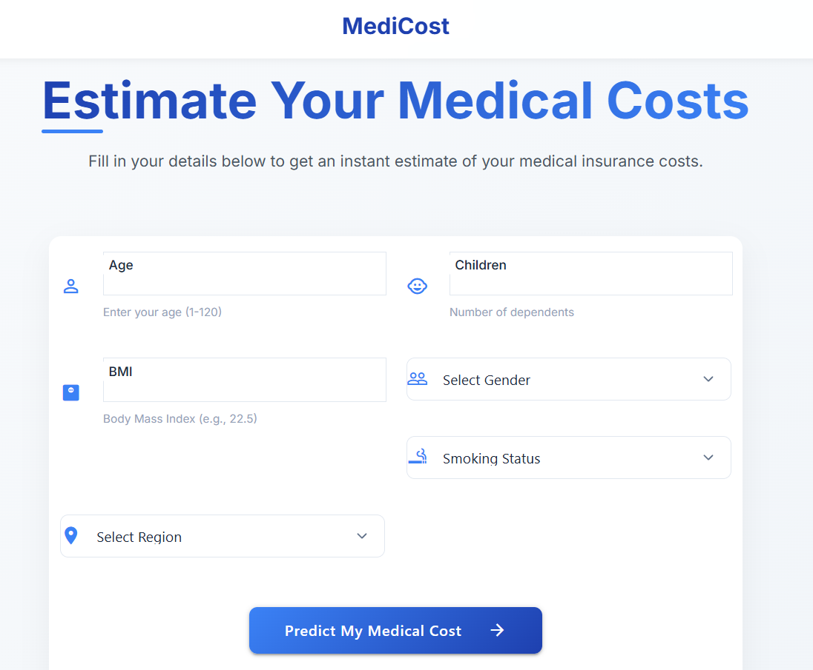

# MediCost - Medical Cost Prediction Web App

A web application that predicts medical insurance costs based on various factors like age, BMI, smoking status, and region. The application is built using Python Flask for the backend and Materialize CSS for the frontend.

## Features

- **User-friendly Interface**: Clean and responsive design that works on all devices
- **Cost Prediction**: Get instant estimates of medical insurance costs
- **Indian Regions**: Specifically tailored for Indian regions
- **Secure**: No data is stored, ensuring complete privacy
- **Modern UI**: Built with Material Design principles for a polished look

## Screenshot



## Installation

1. Clone the repository:
   ```bash
   git clone https://github.com/handshakes-me/MediCost.git
   cd MediCost
   ```

2. Create a virtual environment (recommended):
   ```bash
   python -m venv venv
   venv\Scripts\activate  # On Windows
   ```

3. Install the required packages:
   ```bash
   pip install -r requirements.txt
   ```

4. Run the application:
   ```bash
   python app.py
   ```

5. Open your browser and navigate to `http://localhost:5000`

## Dependencies

- Python 3.7+
- Flask
- scikit-learn
- pandas
- numpy
- gunicorn (for production)

## Project Structure

```
MediCost/
├── app.py                # Main application file
├── requirements.txt      # Python dependencies
├── static/               # Static files (CSS, JS, images)
│   ├── css/
│   ├── js/
│   └── images/
├── templates/            # HTML templates
│   └── home.html         # Main page template
├── insurance.csv         # Dataset
└── indian_healthcare_model.pkl  # Trained model file
```

## Usage

1. Enter your details in the form:
   - Age (1-120)
   - Gender (Male/Female)
   - BMI (Body Mass Index)
   - Number of children (0-10)
   - Smoking status (Yes/No)
   - Region (North India, South India, East India, West India, Central India, North-East India)

2. Click "Predict My Medical Cost" to get your estimated medical insurance cost

## License

This project is licensed under the MIT License - see the LICENSE file for details

## Acknowledgments

- Materialize CSS for the frontend framework
- Flask for the backend framework
- scikit-learn for the machine learning model